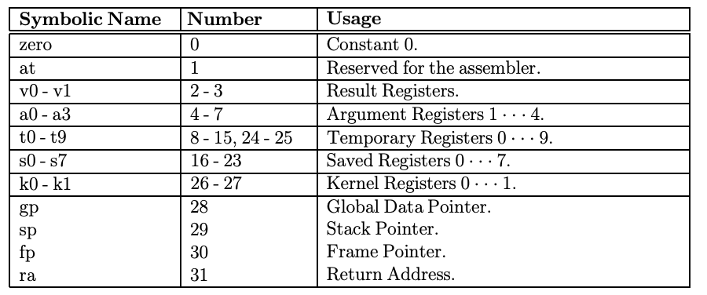

# MIPS Taycore
A single-cycle MIPS Core implemented in Verilog. To be used for TSwift-based MIPS assembly language.

#### Goal
MIPS Processor -> MIPSwizzle Language -> MIPSwizzle Assembler -> Run on MIPS Processor

## Single-Cycle Architecture

## Register Set

## Stages
1. Instruction Fetch
2. Instruction Decode
3. Execution
4. Memory Access
5. Write-back

## Operations Implemented

### R-Type
- add
- sub
- and
- or
- nor
- slt
- sll
- srl

### I-Type
- addi
- beq
- bne
- lw
- sw

### J-Type
- j

## TODO
- Hard: Make the single-cycle MIPS architecture.
- Harder: Interpreter for TSwift-based MIPS assembly language.
- VERY Hard: Re-write the architecture to make pipelining work.